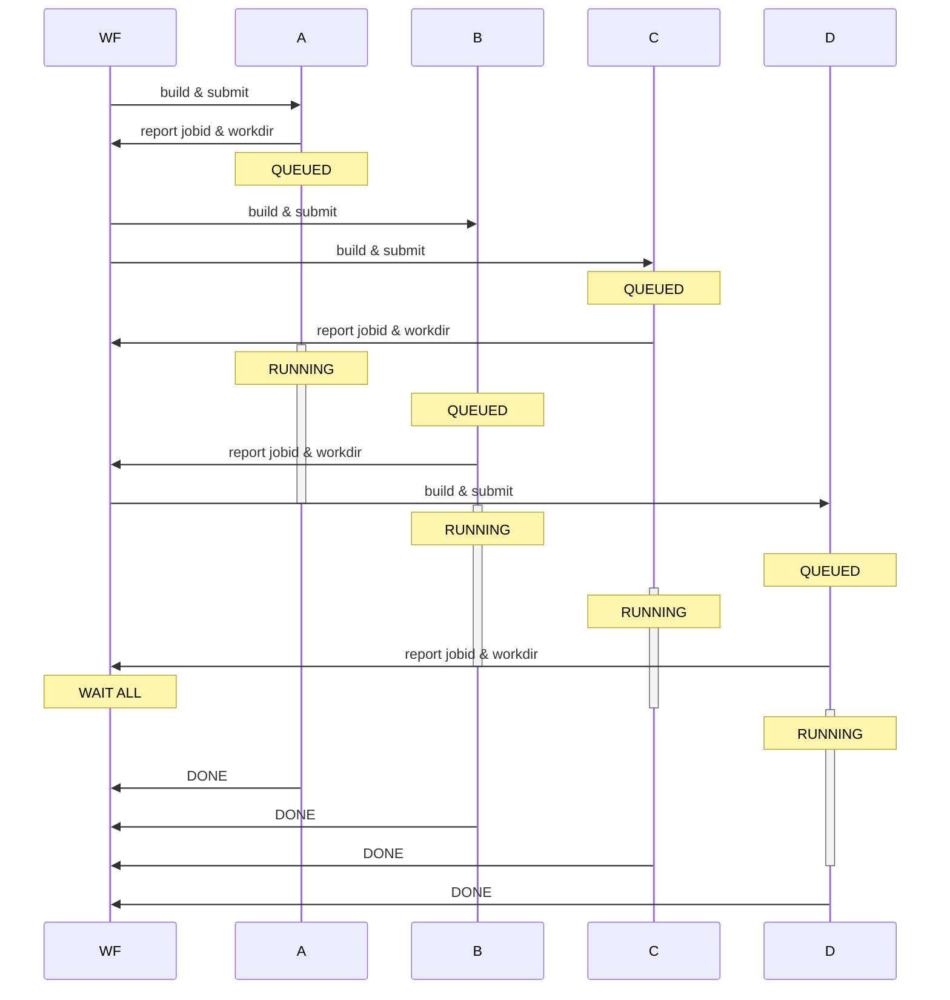

---
# try also 'default' to start simple
theme: default
# random image from a curated Unsplash collection by Anthony
# like them? see https://unsplash.com/collections/94734566/slidev
# background: '#000000'
# some information about your slides (markdown enabled)
title: Pre-Submitting with AiiDA
info: |
  ## Pre-Submitting with AiiDA

  Ideas for making AiiDA fit for workflows with chains of
  long running large scale jobs.

# apply UnoCSS classes to the current slide
class: text-center
# https://sli.dev/features/drawing
drawings:
  persist: false
# slide transition: https://sli.dev/guide/animations.html#slide-transitions
transition: slide-left
# enable MDC Syntax: https://sli.dev/features/mdc
mdc: true
---

# Pre-Submitting with AiiDA

Idea & Proof of Concept


<div class="abs-br m-6 text-xl">
  <button @click="$slidev.nav.openInEditor()" title="Open in Editor" class="slidev-icon-btn">
    <carbon:edit />
  </button>
  <a href="https://github.com/slidevjs/slidev" target="_blank" class="slidev-icon-btn">
    <carbon:logo-github />
  </a>
</div>

<!--
The last comment block of each slide will be treated as slide notes. It will be visible and editable in Presenter Mode along with the slide. [Read more in the docs](https://sli.dev/guide/syntax.html#notes)
-->

---
transition: fade-out
layout: two-cols
---

# The Goal


Box: Job

Arrow A -> B: B has to run after A

Data dependencies: only linking allowed
::right::



<!--
Here is another comment.
-->

---

## Can't Pass CalcJobs around

- Nodes contain **recipe** 🍲 for a CalcJob 🔨
  - entry point
  - "dehydrated" inputs 
  - "dehydrated" async file linking dependencies
- Jsonable ✅

## Can't pre-submit with inexistent source paths

- in "build & submit": add linking of promised files to prepend text ✅

---

## AsyncWf: Mechanism to wait until submitted

````md magic-move
```python
def define(...):
  ...
  spec.outline(
      cls.build_submit,
      engine.while_(cls.submitting)(cls.wait),
      cls.emit_future,
  )
```

```python
def define(...):
  ...
  spec.outline(
      cls.build_submit,
      engine.while_(cls.submitting)(cls.wait),
      cls.emit_future,
  )

def build_submit(self):
  ...  # build from recipe
  self.ctx.submitted = self.submit(builder).uuid
```

```python
def define(...):
  ...
  spec.outline(
      cls.build_submit,
      engine.while_(cls.submitting)(cls.wait),
      cls.emit_future,
  )

def build_submit(self):
  ...  # build from recipe
  self.ctx.submitted = self.submit(builder).uuid

def submitting(self) -> bool:
  submitted = orm.load_node(uuid=self.ctx.submitted)
  return submitted.get_job_id() is None or submitted.get_remote_workdir() is None
```

```python
def define(...):
  ...
  spec.outline(
      cls.build_submit,
      engine.while_(cls.submitting)(cls.wait),
      cls.emit_future,
  )

def build_submit(self):
  ...  # build from recipe
  self.ctx.submitted = self.submit(builder).uuid

def submitting(self) -> bool:
  submitted = orm.load_node(uuid=self.ctx.submitted)
  return submitted.get_job_id() is None or submitted.get_remote_workdir() is None

def wait(self):
  time.sleep(self.ctx.wait_time)
```

```python
def define(...):
  ...
  spec.outline(
      cls.build_submit,
      engine.while_(cls.submitting)(cls.wait),
      cls.emit_future,
  )

def build_submit(self):
  ...  # build from recipe
  self.ctx.submitted = self.submit(builder).uuid

def submitting(self) -> bool:
  submitted = orm.load_node(uuid=self.ctx.submitted)
  return submitted.get_job_id() is None or submitted.get_remote_workdir() is None

def wait(self):
  time.sleep(self.ctx.wait_time)

def emit_future(self):
  submitted = orm.load_node(uuid=self.ctx.submitted)
  self.out("future", create_future(submitted.uuid, submitted.get_job_id(), submitted.get_remote_workdir()))
```
````

---

## GraphWf: Scheduling

````md magic-move
```python
def define(...):
  spec.outline(
    cls.start,
    engine.while_(cls.not_reached_end)(
        cls.submit_front
    ),
    cls.finalize,
  )
```

```python
import networkx as nx

def define(...):
  spec.input("graph", valid_type=orm.JsonableData)
  spec.outline(
    cls.start,
    engine.while_(cls.not_reached_end)(
        cls.submit_front
    ),
    cls.finalize,
  )

def start(self):
  graph = self.inputs.graph.obj
  dag = nx.DiGraph(graph.edges)
  self.ctx.generations = list(nx.topological_generations(dag))
```
````

---
layout: image
image: /example-graph.svg
backgroundSize: contain
---

---

## Planned

- Generalize job recipe idea
- Limit how far to pre-submit
- Do not wait for whole generations, but pre-submit when dependency sub-tree advances
